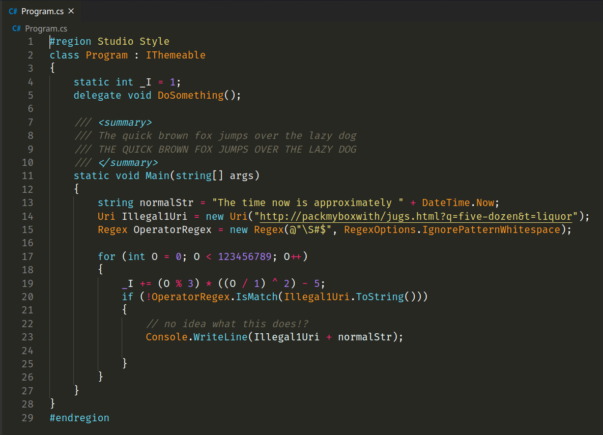

# monokai-visual-studio

Some people who watch Brackeys don't have access to visual studio as some people don't like it or they are on linux. This is a solution if you want Brackeys theme and don't use visual studio. If you don't like his theme try `monodevelop-monokai` which are both meant for C# and legit nothing else.

You want a theme for everything? Then get monokai-apprentice! <a href="https://github.com/def-SpaceWar/monokai-apprentice">monokai-apprentice</a>



If you want semantic so it looks even better add this to your settings.json!

```json
"editor.semanticTokenColorCustomizations": {
    "enabled": true // enable for all themes
}
```
